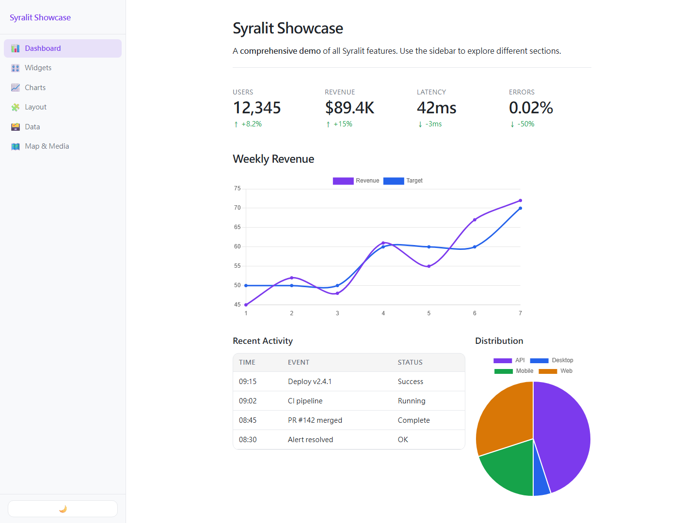
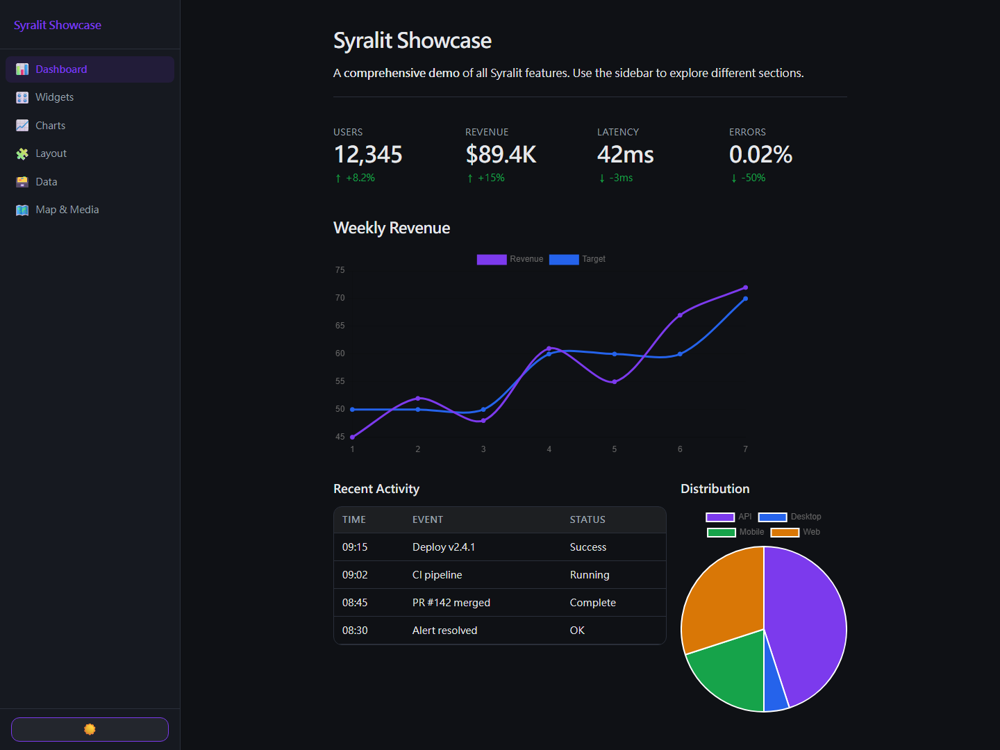
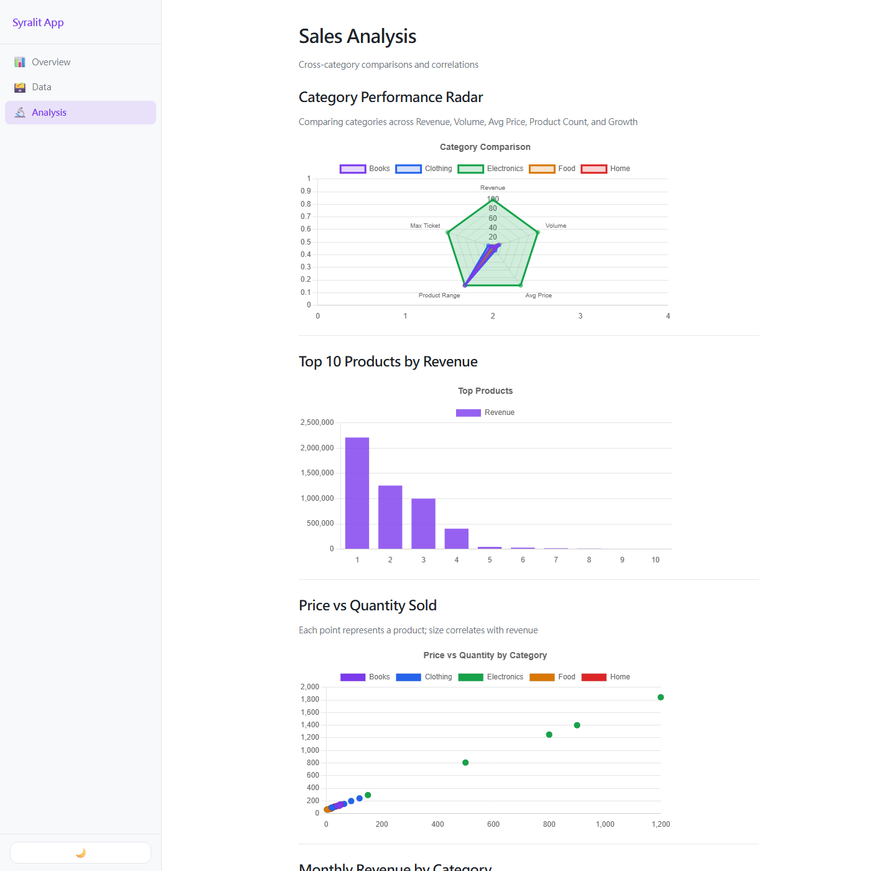
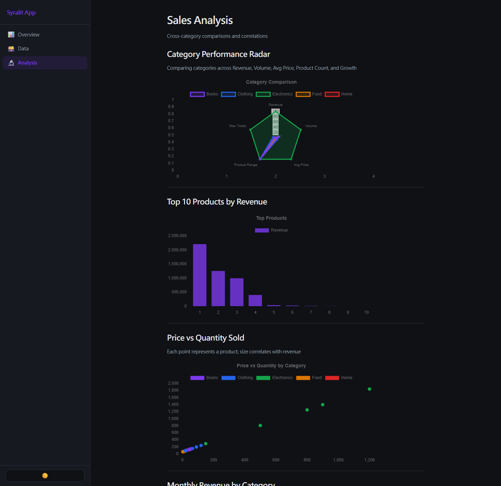
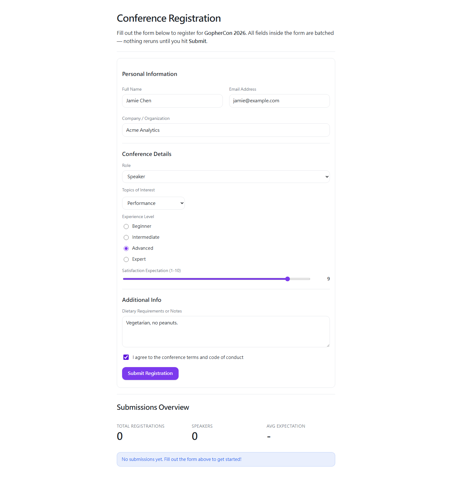
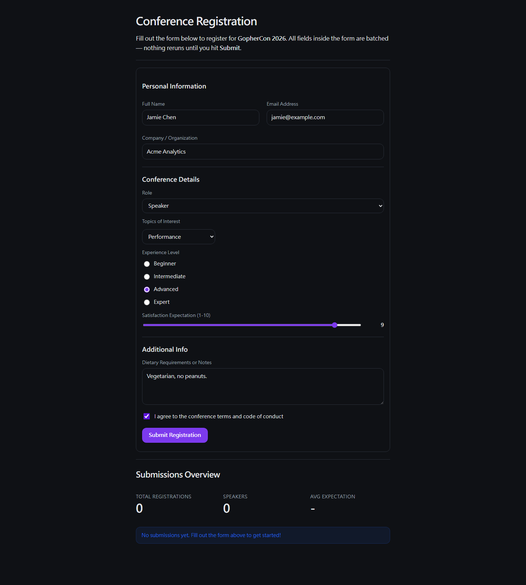

# Syralit

**Interactive data apps in Go.**

[](https://github.com/HazelnutParadise/syralit/actions/workflows/ci.yml)
[](https://pkg.go.dev/github.com/HazelnutParadise/syralit)
[](https://goreportcard.com/report/github.com/HazelnutParadise/syralit)
[](go.mod)
[](LICENSE)

Syralit is a Go-native framework for building interactive data apps, dashboards, and AI tool interfaces — inspired by Streamlit, designed for Go.

Write Go functions, get a live web app. No JavaScript, no HTML templates, no frontend build step.

```go
package main

import sy "github.com/HazelnutParadise/syralit"

func main() {
    sy.App(func() {
        sy.Title("Hello Syralit")
        name := sy.TextInput("Your name")
        if name != "" {
            sy.Success("Hello, " + name + "!")
        }
    })
}
```

## Installation

```bash
go install github.com/HazelnutParadise/syralit/cmd/syralit@latest
```

## Requirements

- Go 1.25+

## Quick Start

```bash
syralit new myapp    # scaffold a new project
cd myapp
syralit dev          # hot reload with state preservation
```

Or manually:

```go
package main

import sy "github.com/HazelnutParadise/syralit"

func main() {
    sy.App(func() {
        sy.Title("My App")
        if sy.Button("Click me") {
            sy.Balloons()
        }
    })
}
```

```bash
go run .
# Open http://localhost:8600
```

## Agent Skills

The [`skills/`](skills/) directory contains [Agent Skills](https://docs.claude.com/en/docs/claude-code/skills) for building Syralit apps with AI coding assistants.

- [`syralit-dev`](skills/syralit-dev/SKILL.md): complete Syralit API reference
- [`syralit-artifact-dsl`](skills/syralit-artifact-dsl/SKILL.md): specialized guide for generating valid Artifact DSL JSON

Install it into your project with the [`skills`](https://github.com/vercel-labs/skills) CLI:

```bash
npx skills add HazelnutParadise/syralit/skills
```

Or copy the `skills/syralit-dev/` folder into your agent's skills directory manually (e.g. `.claude/skills/`).

## Screenshots

Real screenshots captured from the runnable examples in [`examples/`](examples/).

### Showcase dashboard (`examples/showcase`)

| Light | Dark |
|---|---|
|  |  |

### Data explorer (`examples/data-explorer`)

| Light | Dark |
|---|---|
|  |  |

### Conference registration form (`examples/form-app`)

| Light | Dark |
|---|---|
|  |  |

## Beyond Streamlit

Things Syralit does that Streamlit can't, by leaning on Go:

```go
// Background jobs — run work in a goroutine; the page stays responsive and the
// server pushes the result when ready (a Streamlit rerun blocks the whole app).
job := sy.Task("report", func() Report { return buildReport() }) // runs once
if job.Running() {
    sy.Spinner("Crunching…")
} else {
    render(job.Result())
}
```

- **`sy.Task[T]`** — non-blocking background work with auto-push on completion.
- **`sy.Shared[T]`** — app-wide state shared across all sessions; a `Set`/`Update`
  pushes a live update to every connected client (real-time collaboration).
- **`sy.ArtifactCanvas`** — an agent-updatable canvas region rendered from a
  controlled DSL of reusable Syralit components. Apps opt in to a POST endpoint
  with bearer-token auth; new specs animate into place for every open session.
- **`sy.Fragment(key, fn, sy.RunEvery(d))`** — server-driven live refresh.
- **`syralit build`** — compile the whole app (front-end + backend + your
  `public/`) into one self-contained executable; no Python, no runtime, no deps.
- **Fully offline / air-gapped** — `sy.SetAssetURL(name, url)` repoints any
  third-party lib (Chart.js, Leaflet, KaTeX, Plotly, …) to a self-hosted copy;
  drop the files in `public/` and `syralit build` bakes everything into one
  binary that needs no internet or CDN (also satisfies strict CSP).
- **Automatic SSE fallback** — when a WebSocket can't be established (e.g. a
  proxy that blocks WS upgrades), the client transparently switches to a plain
  HTTP transport: Server-Sent Events downstream + POST upstream. No code change.
- **Typed state** via generics (`sy.State[T]`) and typed `sy.Task[T]` results.

## Features

### Input Widgets

| Widget | Returns | Description |
|--------|---------|-------------|
| `Button` | `bool` | Clickable button (true for one rerun) |
| `TextInput` | `string` | Single-line text |
| `PasswordInput` | `string` | Masked text input |
| `TextArea` | `string` | Multi-line text |
| `NumberInput` | `float64` | Number with min/max/step |
| `Slider` | `float64` | Range slider |
| `RangeSlider` | `(float64, float64)` | Two-handle slider returning a (low, high) range |
| `DateSlider` | `string` | Slider over a date range, returns "YYYY-MM-DD" |
| `TimeSlider` | `string` | Slider over a time range, returns "HH:MM" |
| `SelectSlider` | `string` | Discrete slider with labels |
| `Checkbox` | `bool` | Checkbox |
| `Toggle` | `bool` | Toggle switch |
| `Radio` | `string` | Radio button group |
| `SelectBox` | `string` | Dropdown (auto-searchable at 20+ items) |
| `MultiSelect` | `[]string` | Multi-select dropdown |
| `DateInput` | `string` | Date picker (YYYY-MM-DD) |
| `DateRangeInput` | `(string, string)` | Start/end date pickers |
| `TimeInput` | `string` | Time picker (HH:MM) |
| `ColorPicker` | `string` | Color hex picker |
| `FileUploader` | `*UploadedFile` | File upload |
| `CameraInput` | `string` | Webcam capture |
| `AudioInput` | `string` | Microphone recording |
| `ChatInput` | `string` | Chat message input |
| `Feedback` | `string` | Thumbs up/down |
| `SegmentedControl` | `string` | Segmented buttons (`SegmentedControlMulti` → `[]string`) |
| `Pills` | `string` | Pill-style buttons (`PillsMulti` → `[]string`) |
| `Pagination` | `int` | Page selector |

Plus: `DownloadButton`, `LinkButton`, `PageLink`, `Badge`.

### Display

Title, Header, Subheader, Text, Textf, Markdown, Caption, Code (syntax highlighting via highlight.js), LaTeX (KaTeX), JSON (interactive tree), HTML, Image, ImageFromBytes, Audio, Video, Link, Metric (with delta indicators), Progress, Spinner, WriteStream (token-by-token streaming), Component (custom HTML/JS), IFrame, Exception (styled Go `error` box).

### Agent Artifacts

`ArtifactCanvas` renders a shared, animated canvas from a safe DSL. The DSL is
designed for AI agents: it accepts only a curated set of reusable Syralit
components, supports JSON Pointer data binding, and never exposes raw HTML,
custom JS, iframes, or the internal Node protocol.

```go
board := sy.NewArtifactStore("main", sy.ArtifactSpec{
    Version: "v1",
    Layout:  sy.ArtifactLayout{Columns: 2, Gap: 14, Padding: 16},
    Data: map[string]any{
        "summary": map[string]any{"revenue": "$42k"},
    },
    Nodes: []sy.ArtifactNode{{
        ID:        "revenue",
        Component: "metric",
        Props:     map[string]any{"label": "Revenue"},
        Bind:      map[string]string{"props.value": "/summary/revenue"},
    }},
})

sy.HandleArtifactEndpoint(
    "/api/agent/artifacts/main",
    board,
    sy.StaticAgentKey("local-agent", sy.Secrets("AGENT_KEY")),
)

sy.App(func() {
    sy.ArtifactCanvas(board, sy.Height(520))
})
```

Agent updates are full replacements:

```bash
curl -X POST http://127.0.0.1:8600/api/agent/artifacts/main \
  -H "Authorization: Bearer $AGENT_KEY" \
  -H "Content-Type: application/json" \
  -d '{"spec":{"version":"v1","nodes":[{"id":"msg","component":"text","props":{"text":"Updated"}}]}}'
```

For user-managed keys, implement `sy.AgentKeyStore` and render
`sy.AgentKeyManager(store)`. Syralit provides the UI and callback contract; your
app decides whether keys live in memory, a file, a database, or another secret
system.

Full DSL reference: [`docs/artifact-dsl.md`](docs/artifact-dsl.md)

### Data

| Widget | Description |
|--------|-------------|
| `Table` | Static string table |
| `DataFrame` | Sortable table; optional row selection (`sy.Selectable()` → returns selected indices) and typed display via `sy.ColConfig` |
| `DataEditor` | Editable table with 11 column types |

Column configuration (`sy.ColConfig`, shared by DataFrame and DataEditor) supports types `text`, `number`, `checkbox`, `select`, `date`, `time`, `datetime`, `link`, `image`, `progress`, `list`, plus the display-only mini-chart columns `bar_chart` / `line_chart` (cell value is a `[]float64`). Each column may set `Format` (printf-style, e.g. `"$%.2f"`, `"%d%%"`), `Label` (header override), `Help` (header tooltip), `Width`, `Min`/`Max`/`Step`, and `Color` (chart columns). Dynamic row add/delete with `sy.DynamicRows()`.

```go
sy.DataEditor(headers, rows,
    sy.ColConfig(map[string]sy.ColumnConfig{
        "Score": {Type: "number", Min: 0, Max: 100},
        "Pass":  {Type: "checkbox"},
        "Grade": {Type: "select", Options: []string{"A", "B", "C"}},
    }),
    sy.DynamicRows(),
)
```

### Charts

Built-in interactive charts powered by **Chart.js**:

| Chart | Input | Description |
|-------|-------|-------------|
| `LineChart` | `map[string][]float64` | Line chart with multiple series |
| `BarChart` | `map[string][]float64` | Bar chart |
| `AreaChart` | `map[string][]float64` | Filled line chart |
| `ScatterChart` | `map[string][][2]float64` | Scatter plot with xy pairs |
| `PieChart` | `map[string]float64` | Pie chart |
| `DoughnutChart` | `map[string]float64` | Doughnut chart |
| `HistogramChart` | `[]float64, bins` | Histogram from raw data |
| `RadarChart` | `labels, map[string][]float64` | Radar/spider chart |
| `GraphvizChart` | `dot string` | Graphviz DOT via viz.js |

Bar/area/line charts accept `sy.Stacked()`, `sy.Horizontal()` (bar), `sy.Colors([]string{...})`, `sy.XLabels(...)`, and `sy.ChartTitle(...)`.

External charting library integrations (CDN-loaded, accepting JSON specs):

| Chart | Library | Streamlit Equivalent |
|-------|---------|---------------------|
| `VegaLiteChart` | Vega-Lite / vega-embed | `st.altair_chart` |
| `PlotlyChart` | Plotly.js | `st.plotly_chart` |
| `PyplotChart` | SVG/PNG images | `st.pyplot` |
| `BokehChart` | BokehJS | `st.bokeh_chart` |
| `PydeckChart` | deck.gl | `st.pydeck_chart` |

### Layout

```go
// Columns (equal or weighted)
cols := sy.Columns(3)
cols[0](func() { sy.Text("Col 1") })

cols := sy.WeightedColumns(2, 1, 1)

// Tabs
tab := sy.Tabs([]string{"Tab1", "Tab2"})
tab("Tab1", func() { sy.Text("Content 1") })

// Other containers
sy.Sidebar(func() { ... })
sy.Expander("Title", func() { ... })
sy.Container(func() { ... }, sy.Border())
sy.Form("key", func() { ... }, sy.ClearOnSubmit())  // ClearOnSubmit optional
sy.Status("Loading", "running", func() { ... })
sy.Fragment("key", func() { ... })  // partial rerun
```

### State & Session

```go
// Typed state (persists across reruns)
count := sy.State("count", 0)
count.Get()
count.Set(42)

// Query parameters
val := sy.QueryParam("page")

// Request context (headers, cookies, host, IP, locale) — st.context
ctx := sy.Context()
lang := ctx.Locale

// Flow control
sy.Stop()   // halt rendering
sy.Rerun()  // force rerun
```

### Multi-Page Apps

```go
func init() {
    sy.AddPage("Home", homePage, sy.PageIcon("🏠"), sy.PageOrder(1))
    sy.AddPage("About", aboutPage, sy.PageIcon("ℹ️"), sy.PageOrder(2))
}

func main() { sy.App(nil) }
```

### Auth

```go
// Login gate blocks rendering until authenticated
username := sy.LoginGate(func(user, pass string) bool {
    return user == "admin" && pass == "secret"
})

// Role-based access
user := sy.User()  // map[string]string or nil
sy.Login(map[string]string{"name": "admin", "role": "admin"})
sy.Logout()
```

### Caching

```go
data := sy.CacheData("key", func() []Row {
    return fetchFromDB()
}, sy.TTL(5 * time.Minute))

db := sy.CacheResource("db", func() *sql.DB {
    return openDB()
})
```

### Feedback & Notifications

```go
sy.Success("Done!")
sy.Error("Failed!")
sy.Warning("Watch out")
sy.Info("Note")
sy.Toast("Message", "success")
sy.Balloons()
sy.Snow()
sy.Dialog("Settings", func() { ... })
```

### Streaming (LLM Output)

```go
sy.WriteStream(func(yield func(string)) {
    for _, word := range words {
        yield(word + " ")
        time.Sleep(30 * time.Millisecond)
    }
})
```

### Chat UI

```go
msgs := sy.State("msgs", []map[string]string{})
for _, m := range msgs.Get() {
    sy.ChatMessage(m["role"], func() {
        sy.Markdown(m["content"])
    })
}
if input := sy.ChatInput("Ask something..."); input != "" {
    msgs.Set(append(msgs.Get(), map[string]string{
        "role": "user", "content": input,
    }))
}
```

### Maps

```go
sy.Map([]sy.MapPoint{
    {Lat: 25.0330, Lon: 121.5654, Text: "Taipei 101"},
}, sy.Height(450))
```

### Database

```go
db := sy.Connection("mydb")
rows := sy.SQLQuery(db, "SELECT * FROM users")
```

## Common Options

```go
sy.Key("unique_key")        // stable widget identity
sy.DefaultValue(val)         // initial value
sy.Placeholder("hint")      // placeholder text
sy.Help("tooltip")          // help tooltip
sy.Disabled()               // disable widget
sy.Min(0), sy.Max(100)      // numeric range
sy.Step(0.5)                // numeric step
sy.Height(300), sy.Width(400)
sy.ChartTitle("Title")      // chart title
sy.Border()                 // container border
sy.Color("green")           // element color
sy.Language("go")           // code language

// Button styling (Button, LinkButton, DownloadButton)
sy.Icon("🚀")               // prefix a button label with an icon
sy.ButtonType("secondary")  // "primary" (default), "secondary", "tertiary"
sy.UseContainerWidth()      // make a button span its container

sy.Border()                 // also: bordered Metric card
sy.MinDate("2026-01-01")    // DateInput / DateRangeInput lower bound
sy.MaxDate("2026-12-31")    // DateInput / DateRangeInput upper bound
```

## Insyra Integration

Syralit has first-class support for [Insyra](https://github.com/HazelnutParadise/insyra) `DataTable` and `DataList` via a cleanly separated adapter package. The core framework never imports Insyra.

```go
import syi "github.com/HazelnutParadise/syralit/integrations/insyra"

// DataTable (multi-column)
syi.Table(dt)                           // render DataTable
syi.Preview(dt, 5)                      // first N rows
syi.EditableTable(dt, sy.Key("edit"))   // editable DataTable
col := syi.ColumnSelect("Column", dt)   // column picker
syi.Metrics(dt, col)                    // count, mean, min, max
syi.BarChart(dt, "Category", "Value")   // chart from columns
syi.LineChart(dt, "Month", "Revenue")
syi.ScatterChart(dt, "X", "Y")

// DataList (single series) — the symmetric counterpart
syi.List(dl)                            // single-column table
syi.ListPreview(dl, 5)                  // first N values
syi.EditableList(dl, sy.Key("edl"))     // editable single column → []any
syi.ListMetrics(dl)                     // count, mean, min, max
syi.ListDescribe(dl)                    // count/mean/std/min/25%/50%/75%/max
syi.ListBarChart(dl)                    // value over index
syi.ListLineChart(dl)
syi.ListAreaChart(dl)
syi.Histogram(dl, 20)                   // distribution (list-only)

// Statistical analysis (insyra/stats), rendered in the UI
syi.Describe(dt)                              // full per-column summary table
syi.Correlation(dt, "X", "Y", "pearson")     // r + p as metrics
syi.CorrelationMatrix(dt, "pearson")         // pairwise correlation matrix
syi.LinearRegression(dt, "Y", "X1", "X2")    // R²/coeffs table + scatter
syi.TTest(dt, "A", "B", false)               // two-sample t-test

// Load a file into a DataTable (CSV / Excel / JSON)
dt := syi.UploadTable("Upload data")         // file uploader → *DataTable
dt, err := syi.ParseTable(name, bytes)       // parse bytes from any source

// Interactive transforms (non-destructive)
out := syi.FilterBuilder(dt)                 // column/op/value row filter
out := syi.CCLBuilder(dt)                    // add a computed column (CCL)
```

Native interactive charts beyond the built-in Chart.js layer (Sankey, word
cloud, K-line, gauge, funnel, …) live in a separate opt-in subpackage, because
they pull in go-echarts and (transitively) chromedp:

```go
import syiplot "github.com/HazelnutParadise/syralit/integrations/insyra/eplot"
import "github.com/HazelnutParadise/insyra/plot"

syiplot.WordCloud(dl, "Tags")                       // no Chart.js equivalent
syiplot.EChart(plot.CreateSankeyChart(cfg, links...)) // any insyra/plot chart

syiplot.SetOffline(true) // inline echarts JS into each chart — no CDN, runs
                         // air-gapped / under strict CSP / as a `syralit build` binary
```

## Configuration

### syralit.toml

```toml
title = "My App"
host = "0.0.0.0"
port = 8600

[theme]
primary_color = "#ff4b4b"
background_color = "#0e1117"
text_color = "#fafafa"

[secrets]
api_key = "sk-..."
db_dsn = "postgres://..."
```

### Runtime Configuration

```go
sy.SetPageConfig(
    sy.PageTitle("My App"),
    sy.PageLayout("wide"),
    sy.ConfigIcon("🚀"),
    sy.PrimaryColor("#ff4b4b"),
)

apiKey := sy.Secrets("api_key")
```

## CLI Commands

| Command | Description |
|---------|-------------|
| `syralit new <name>` | Scaffold a new project in a new folder |
| `syralit new .` | Scaffold into the current directory (no wrapper folder) |
| `syralit dev` | Hot reload with state preservation |
| `syralit run` | Build and run once (no watching) |
| `syralit build [-o out] [dir]` | Compile to a single self-contained executable |

## Static Files & Bundling

Drop files in a `public/` directory and they're served at the site root —
`public/logo.png` → `/logo.png`. In `syralit dev` they're served from disk; for
production, `syralit build` folds `public/` (and any `assets/` overrides) into
the binary via `//go:embed`, so the result is **one executable with the
front-end, backend, and all your static files** — nothing to copy alongside it.

```bash
syralit build              # → ./<dir-name>[.exe], everything embedded
syralit build -o myapp .   # custom output path
```

You can also wire static files manually with `sy.Static(fsys)` (served at the
root) and `sy.StaticAssets(fsys)` (overrides the built-in front-end assets).

## Testing

`sy.RenderOnce(appFn) *Node` runs an app function once in an isolated session
and returns the UI tree — no server needed. Walk it with `Node.Find(type)`:

```go
tree := sy.RenderOnce(func() { sy.Metric("Users", "24,891") })
if len(tree.Find("metric")) != 1 { t.Fatal("expected a metric") }
```

## Examples

The [`examples/`](examples/) directory contains runnable demo apps:

| Example | Description |
|---------|-------------|
| [`hello`](examples/hello/) | Minimal single-page app with basic widgets |
| [`showcase`](examples/showcase/) | Comprehensive 6-page demo of all features |
| [`chatbot`](examples/chatbot/) | Chat UI with simulated streaming AI responses |
| [`form-app`](examples/form-app/) | Conference registration form with validation |
| [`data-explorer`](examples/data-explorer/) | 3-page sales dashboard with charts, filters, and data editing |
| [`auth-demo`](examples/auth-demo/) | Authentication with LoginGate and role-based access control |
| [`agent-artifact`](examples/agent-artifact/) | Artifact Canvas studio with multiple live boards, preset scenarios, local compose controls, and agent endpoints |
| [`mega-demo`](examples/mega-demo/) | 10-page app showcasing every feature: all widgets, charts, layout, forms, data tables, chat, maps, state |
| [`insyra-demo`](examples/insyra-demo/) | Insyra integration: tables, stats, transforms, file upload, native charts |
| [`insyra-charts`](examples/insyra-charts/) | Native go-echarts charts (Sankey/gauge/funnel/word cloud) with offline inlining |
| [`embed-scroll`](examples/embed-scroll/) | Themed scrollbars inside embedded `Component` iframes (follow light/dark) |

Run any example:

```bash
cd examples/chatbot
go run .
```

## Streamlit parity

Syralit covers the commonly-used Streamlit surface in idiomatic Go. See
[docs/STREAMLIT_PARITY.md](docs/STREAMLIT_PARITY.md) for the full mapping and the
few intentional gaps.

## Changelog

See [CHANGELOG.md](CHANGELOG.md).

## License

MIT
